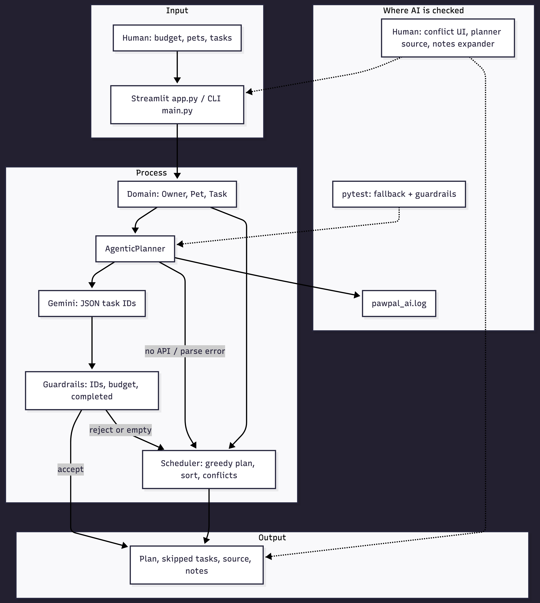
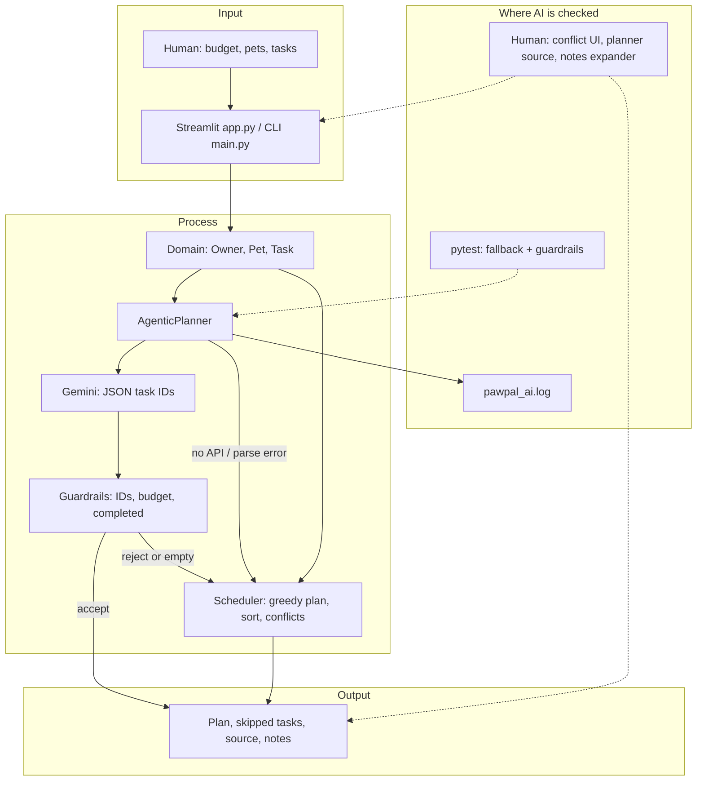

# 🐾 PawPal+

A Streamlit app that helps a busy pet owner stay consistent with pet care by building a smart daily schedule based on priorities, time constraints, and task history.

---

## 📸 Demo


---

## ✨ Features

### Owner & Pet Management
- Set your name and how many minutes you have available for pet care today
- Add multiple pets with name, species, and age
- All data persists in memory across interactions using `st.session_state`

### Task Scheduling
- Add care tasks (Walk, Feeding, Medication, Grooming, Enrichment) to any pet
- Set duration, priority (1–5), due time, and frequency (daily / weekly / once)
- Tasks are linked directly to their pet so the scheduler always knows who a task belongs to

### Sorting by Time
- The **By Time** tab displays all tasks sorted chronologically using `Scheduler.sort_tasks_by_time()`
- Uses Python's `sorted()` with a `lambda` key on `(due_date, due_time)` so "08:00" always comes before "09:00"

### Filtering
- **Filter by Pet** tab lets you pick one pet and see only their tasks via `filter_tasks_by_pet()`
- **Pending Only** tab shows incomplete tasks via `filter_tasks_by_status(completed=False)`, so you always know what's left

### Priority-Based Daily Plan
- "Generate Schedule" runs `generate_daily_plan(time_available)` — a greedy algorithm that picks tasks in descending priority order until your time budget is exhausted
- Tasks that don't fit are listed separately so you know exactly what got left out and why

### Agentic AI Workflow (Gemini + Guardrails)
- `AgenticPlanner` is integrated into app flow (not a standalone script): it plans tasks with Gemini and then verifies output before use
- Agent loop is **plan → validate → execute/fallback**:
  - Plan: Gemini proposes `selected_task_ids` in JSON
  - Validate: IDs must exist, cannot be completed, must fit owner time budget
  - Execute/Fallback: valid output is used; invalid/unavailable AI automatically falls back to deterministic scheduling
- Planner emits operational logs to `pawpal_ai.log` for reproducibility and debugging

### Conflict Detection
- `get_conflict_warnings()` scans for any two tasks sharing the same date and time slot
- Warnings appear as a **red banner** at the top of the View Tasks section the moment a conflict exists — before you generate a plan — so you can fix it immediately

### Recurring Tasks
- When you mark a daily task complete, `mark_task_complete()` automatically creates the next occurrence for tomorrow using `timedelta(days=1)`
- Weekly tasks roll forward by 7 days the same way

---

## 🏗️ Architecture

### System diagram (design overview)

The diagram below matches `assets/system-architecture.mmd` (you can export a PNG from [Mermaid Live](https://mermaid.live) into `assets/` for screenshots).





**Main components:** presentation (`app.py`, `main.py`), domain model (`Owner`, `Pet`, `Task` in `pawpal_system.py`), **agent** (`AgenticPlanner` + Gemini), **validator** (guardrails inside `ai_planner.py`), **deterministic core** (`Scheduler` for fallback and for sort/filter/conflicts).

**Data flow:** human input (time budget, pets, tasks) → UI/session → domain state → `AgenticPlanner` asks Gemini for candidate task IDs → guardrails enforce real IDs, time budget, and non-completed tasks → accepted plan becomes the schedule; otherwise **Scheduler** produces a greedy plan so behavior stays safe and reproducible.

**Human and testing:** automated **pytest** covers scheduler behavior and planner fallback/guardrails; **logging** records planner decisions and failures; the **human** reviews conflict banners, the chosen plan, and optional AI rationale in the UI before trusting the day’s schedule.

### Class responsibilities (`pawpal_system.py`)

| Class | Responsibility |
|---|---|
| `Owner` | Top-level container; holds pets, time budget, and handles JSON persistence |
| `Pet` | Stores pet info and owns its list of tasks |
| `Task` | Atomic care item with type, duration, priority, schedule, and recurrence |
| `Scheduler` | Stateless service; sorting, filtering, conflict detection, daily plan generation |

---

## 🧪 Testing

Run the full test suite with:

```bash
python -m pytest
```

The suite lives in `test/test_pawpal.py` and covers five behaviors:

| Test | What it checks |
|---|---|
| `test_mark_complete_changes_task_status` | `mark_complete()` flips the `completed` flag |
| `test_add_task_increases_pet_task_count` | `pet.add_task()` appends to the task list |
| `test_sort_tasks_by_time_returns_chronological_order` | Tasks come back sorted earliest-first regardless of insertion order |
| `test_daily_task_completion_creates_next_day_task` | Completing a daily task creates tomorrow's copy with the correct date |
| `test_conflict_detection_flags_same_date_and_time` | Two tasks at the same slot produce a readable warning |
| `test_agentic_planner_falls_back_without_model` | Missing model/API path safely falls back to rule-based planner |
| `test_agentic_planner_guardrails_drop_invalid_ids` | Guardrails clean invalid model output before scheduling |

**Confidence level: ★★★★☆** — core behaviors covered; edge cases (empty task list, zero time budget, JSON round-trip) are the next priority.

---

## 🚀 Getting Started

```bash
python -m venv .venv
source .venv/bin/activate  # Windows: .venv\Scripts\activate
pip install -r requirements.txt
export GEMINI_API_KEY="your_api_key_here"  # Windows PowerShell: $env:GEMINI_API_KEY="your_api_key_here"
streamlit run app.py
```

Open [http://localhost:8501](http://localhost:8501) in your browser.

---

## 🗂️ Project Structure

```
pawpal_system.py   # Core logic: Owner, Pet, Task, Scheduler
ai_planner.py      # Agentic Gemini planner with validation/fallback guardrails
app.py             # Streamlit UI
main.py            # Terminal demo of all scheduling features
assets/            # System architecture Mermaid + optional exported screenshots
test/
  test_pawpal.py   # Automated test suite
pawpal_ai.log      # Runtime AI planner logs (created automatically)
mermaid-image      # UML class diagram (Mermaid.js)
reflection.md      # Design decisions and AI collaboration notes
```
