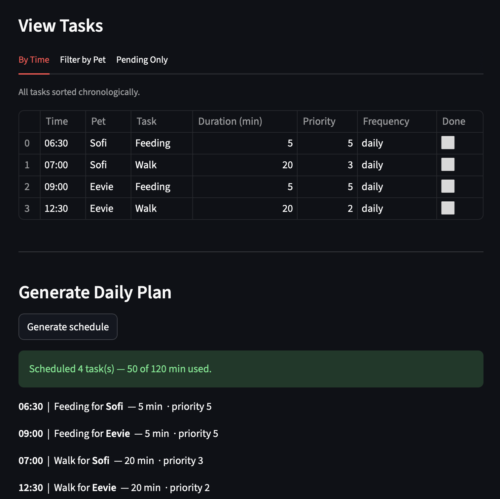
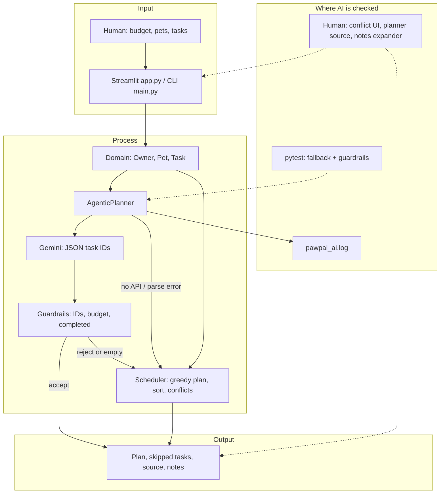

# 🐾 PawPal+

## Submission deliverables (course checklist)

| Requirement | Where it lives |
|---------------|----------------|
| Functional code | `pawpal_system.py`, `ai_planner.py`, `app.py`, `main.py`, `evaluate_ai_planner.py`, `test/test_pawpal.py` |
| Comprehensive **README.md** | This file (base project, setup, architecture, samples, testing, reliability) |
| **Model card** (reflections / AI / biases / testing) | **`model_card.md`** |
| System architecture diagram | Embedded in **Architecture** below + **`assets/system-architecture.png`** (+ `assets/system-architecture.mmd` source) |
| Demo screenshot | **`assets/demo.png`** |
| Extra UML (classes) | **`assets/class-diagram.mmd`** and **`assets/uml-class-diagram.png`** |

Commit history on `main` is split into **multiple commits** (planner, architecture docs, README steps, reliability, agent trace stretch, etc.) so reviewers can follow the story in `git log`.

---

## For anyone reviewing this repo

**Original project (Modules 1–3).** This repo is my **PawPal+** scheduling system from CodePath’s Applied AI coursework—the early milestones focused on modeling a pet owner’s world cleanly (`Owner`, `Pet`, `Task`) and proving scheduling behavior with a `Scheduler` (sorting, filtering, conflicts, recurring tasks, and a greedy daily plan under a time budget). The goal was never “fancy UI for its own sake”; it was to make the domain logic trustworthy enough that a real person could rely on it.

**What I added for the final stretch.** I kept that core, then wired in an **agentic** layer: Gemini proposes which task IDs belong in today’s plan, my code **checks** that output (real IDs, not completed, fits the minute budget), and if anything is off—or the API is missing—the app **falls back** to the same deterministic scheduler it always had. That way the AI actually changes behavior when it’s available, but the product doesn’t fall apart when it isn’t.

**Why I care about this problem.** I’ve watched people (myself included) drop balls on pet care when life gets busy. A schedule that explains what made the cut—and what didn’t—feels more honest than a black box that pretends everything fits.

---

## 📸 Demo



---

## Sample interactions

These are realistic outcomes I look for when I sanity-check the app myself.

### 1) No API key — the app still schedules something sensible

**What I did:** I set my name and “time available today” to **45 minutes**, added one dog, then added two incomplete tasks: a **30 min** walk (priority 5) and a **20 min** feeding (priority 4).

**What came back:** The planner reported **`fallback`** (Gemini wasn’t configured), and the plan included **only the walk**, because it’s higher priority and the feeding would blow the 45-minute budget if I forced both. The feeding showed up under skipped / not planned for that run.

That interaction matters to me because it proves the “AI upgrade” didn’t replace reliability—it sits on top of it.

### 2) Same time slot for two pets — I get yelled at (in a good way)

**What I did:** I gave two different pets tasks at **08:00** on the same day.

**What came back:** The UI surfaced a **conflict warning** before I even generated a plan. That’s the system telling me my input is physically dubious, not quietly baking nonsense into a schedule.

### 3) With `GEMINI_API_KEY` set — I can see the agent path (and still trust the guardrails)

**What I did:** Same setup as (1), but I exported a Gemini key in my shell and hit **Generate schedule** again.

**What came back:** The UI showed **`gemini`** as the planner source, listed the chosen tasks, and the “planner notes” expander included the model’s short rationale/checks when the API returned structured JSON. If the model ever returns junk IDs or hallucinates tasks, my guardrails strip that down; if nothing valid remains, I fall back to the greedy scheduler again.

---

## ✨ Features

### Owner & Pet Management
- Set your name and how many minutes you have available for pet care today
- Add multiple pets with name, species, and age
- All data persists in memory across interactions using `st.session_state`

### Task Scheduling
- Add care tasks (Walk, Feeding, Medication, Grooming, Enrichment) to any pet
- Set duration, priority (1–5), due time, and frequency (daily / weekly / once)
- Tasks are linked directly to their pet so the scheduler always knows who a task belongs to

### Sorting by Time
- The **By Time** tab displays all tasks sorted chronologically using `Scheduler.sort_tasks_by_time()`
- Uses Python's `sorted()` with a `lambda` key on `(due_date, due_time)` so "08:00" always comes before "09:00"

### Filtering
- **Filter by Pet** tab lets you pick one pet and see only their tasks via `filter_tasks_by_pet()`
- **Pending Only** tab shows incomplete tasks via `filter_tasks_by_status(completed=False)`, so you always know what's left

### Priority-Based Daily Plan
- "Generate Schedule" runs `generate_daily_plan(time_available)` — a greedy algorithm that picks tasks in descending priority order until your time budget is exhausted
- Tasks that don't fit are listed separately so you know exactly what got left out and why

### Agentic AI Workflow (Gemini + Guardrails)
- `AgenticPlanner` is integrated into app flow (not a standalone script): it plans tasks with Gemini and then verifies output before use
- Agent loop is **plan → validate → execute/fallback**:
  - Plan: Gemini proposes `selected_task_ids` in JSON
  - Validate: IDs must exist, cannot be completed, must fit owner time budget
  - Execute/Fallback: valid output is used; invalid/unavailable AI automatically falls back to deterministic scheduling
- Planner emits operational logs to `pawpal_ai.log` for reproducibility and debugging

### Stretch: Agentic workflow enhancement (observable multi-step trace)
- Every `plan_day()` run records a **`steps`** list: numbered phases such as listing open tasks, reading the owner time budget, computing a **Scheduler** baseline, building the prompt, calling the model (with a **truncated raw response** preview for transparency), JSON parse, ID filtering, budget enforcement, and a final **Decide** branch (Gemini vs fallback).
- In Streamlit, expand **“Agent trace (multi-step reasoning)”** after you generate a schedule to watch the chain end-to-end. `main.py` prints the same trace in the terminal.
- I used **Cursor Agent mode** to help implement this cleanly across `ai_planner.py`, `app.py`, and `main.py` without breaking existing guardrails or tests.

### Conflict Detection
- `get_conflict_warnings()` scans for any two tasks sharing the same date and time slot
- Warnings appear as a **red banner** at the top of the View Tasks section the moment a conflict exists — before you generate a plan — so you can fix it immediately

### Recurring Tasks
- When you mark a daily task complete, `mark_task_complete()` automatically creates the next occurrence for tomorrow using `timedelta(days=1)`
- Weekly tasks roll forward by 7 days the same way

---

## 🏗️ Architecture

### System diagram (how I think about the system)

I drew this diagram for myself first, then cleaned it up for the README. It matches `assets/system-architecture.mmd` if you want to tweak it in [Mermaid Live](https://mermaid.live).




**Main components:** presentation (`app.py`, `main.py`), domain model (`Owner`, `Pet`, `Task` in `pawpal_system.py`), **agent** (`AgenticPlanner` + Gemini), **validator** (guardrails inside `ai_planner.py`), **deterministic core** (`Scheduler` for fallback and for sort/filter/conflicts).

**Data flow:** human input (time budget, pets, tasks) → UI/session → domain state → `AgenticPlanner` asks Gemini for candidate task IDs → guardrails enforce real IDs, time budget, and non-completed tasks → accepted plan becomes the schedule; otherwise **Scheduler** produces a greedy plan so behavior stays safe and reproducible.

**Human and testing:** automated **pytest** covers scheduler behavior and planner fallback/guardrails; **logging** records planner decisions and failures; the **human** reviews conflict banners, the chosen plan, and optional AI rationale in the UI before trusting the day’s schedule.

### Class responsibilities (`pawpal_system.py`)

| Class | Responsibility |
|---|---|
| `Owner` | Top-level container; holds pets, time budget, and handles JSON persistence |
| `Pet` | Stores pet info and owns its list of tasks |
| `Task` | Atomic care item with type, duration, priority, schedule, and recurrence |
| `Scheduler` | Stateless service; sorting, filtering, conflict detection, daily plan generation |

---

## Design decisions (trade-offs I actually made)

- **I kept conflict detection “exact slot” based** (same date + same `due_time`) instead of building full interval overlap math across durations. I’m trading away some theoretical precision for code I can reason about quickly—and I documented that limitation on purpose.
- **I made the AI propose IDs, not mutate objects directly.** That sounds pedantic, but it’s the difference between “the model narrates a plan” and “the model is allowed to invent state.” IDs are easy to validate; free-form schedules are not.
- **Fallback is not a separate demo path.** If Gemini fails, I still return a plan from the same interface. I didn’t want a portfolio project that only works when the network behaves.

---

## 🧪 Testing

Run the full test suite with:

```bash
python -m pytest
```

The suite lives in `test/test_pawpal.py` and covers **eight** behaviors:

| Test | What it checks |
|---|---|
| `test_mark_complete_changes_task_status` | `mark_complete()` flips the `completed` flag |
| `test_add_task_increases_pet_task_count` | `pet.add_task()` appends to the task list |
| `test_sort_tasks_by_time_returns_chronological_order` | Tasks come back sorted earliest-first regardless of insertion order |
| `test_daily_task_completion_creates_next_day_task` | Completing a daily task creates tomorrow's copy with the correct date |
| `test_conflict_detection_flags_same_date_and_time` | Two tasks at the same slot produce a readable warning |
| `test_agentic_planner_falls_back_without_model` | Missing model/API path safely falls back to rule-based planner |
| `test_agentic_planner_guardrails_drop_invalid_ids` | Guardrails clean invalid model output before scheduling |
| `test_planner_invariants_hold_under_flaky_model` | Repeated bad model output never yields an unsafe plan (budget + real tasks) |

### Testing summary (plain English)

What worked: once I wrote small tests around the scheduler and the planner guardrails, I stopped “eyeballing” schedules every time I changed something. That sounds obvious, but it saved me from regressions when I touched the Streamlit UI.

What didn’t: I still can’t fully automate “Gemini returned something weird today” without either recording live responses or mocking the API. I chose mocks for unit tests and kept logs for real runs—that’s a compromise, not perfection.

What I learned: the moment I tried to prove behavior with tests, my design got simpler. If I couldn’t test it, I usually didn’t fully understand it yet.

---

## Reliability & evaluation (Step 4)

I wanted the AI piece to be **provable**, not just impressive in a demo. Here is how I actually check it:

| Mechanism | What it does |
|-----------|----------------|
| **pytest** | Unit tests for the scheduler plus planner fallback and guardrails; I also added a looped test that hammers the planner with **bad JSON and bogus task IDs** and asserts the returned plan never breaks basic safety rules. |
| **`verify_plan_result()`** in `ai_planner.py` | Small invariant checker: every task in the plan must be a real, incomplete task, IDs must not repeat, and total planned minutes must not exceed the owner’s budget. |
| **`evaluate_ai_planner.py`** | Runnable stress script (no Gemini key needed) that cycles through flaky mock responses and prints a one-line summary you can paste into a writeup. |
| **`pawpal_ai.log`** | When something fails at runtime (parse error, API missing, etc.), I can see *that* it failed and *why*, instead of silently guessing. |
| **Human pass** | I still read conflict warnings and the “planner source” line in the UI before I treat a day as “locked in.” |

**One-line summary (mock stress, last run):** 36 of 36 trials stayed within budget and only referenced real tasks; invalid JSON and hallucinated IDs were absorbed by guardrails or fallback scheduling. Your numbers may differ slightly if you change the mock responses or task fixture.

Run the evaluator yourself:

```bash
python evaluate_ai_planner.py
```

---

## Reflection (what this taught me about AI)

I went into this thinking the “hard part” would be calling Gemini. The hard part turned out to be **deciding what the model is allowed to change** and **how to fail gracefully** when it’s wrong.

The biggest mindset shift for me was treating the model like a fast intern: great for drafting a candidate plan, terrible as a source of truth. Putting validation in Python—boring, explicit code—made the AI feature feel *safer*, not scarier.

For course-style reflection prompts (collaboration, bias, testing, ethics), see **`model_card.md`**. For the longer narrative design write-up, see **`reflection.md`** (**section 6** is ethics).

---

## 🚀 Getting Started

```bash
python -m venv .venv
source .venv/bin/activate  # Windows: .venv\Scripts\activate
pip install -r requirements.txt
```

Optional (enables Gemini planning):

```bash
export GEMINI_API_KEY="your_api_key_here"  # Windows PowerShell: $env:GEMINI_API_KEY="your_api_key_here"
```

Run the web app:

```bash
streamlit run app.py
```

Open [http://localhost:8501](http://localhost:8501) in your browser.

Run the terminal demo (scheduler + persistence + planner section):

```bash
python main.py
```

Run tests:

```bash
python -m pytest
```

Stress-check the planner (mock AI, no API key):

```bash
python evaluate_ai_planner.py
```

---

## 🗂️ Project Structure

```
pawpal_system.py   # Core logic: Owner, Pet, Task, Scheduler
ai_planner.py      # Agentic Gemini planner with validation/fallback guardrails
evaluate_ai_planner.py  # Mock stress run + one-line reliability summary
app.py             # Streamlit UI
main.py            # Terminal demo of all scheduling features
model_card.md      # Model card: AI use, bias, testing, collaboration (submission)
assets/
  demo.png                 # Streamlit demo screenshot
  system-architecture.png  # System diagram (also in README)
  system-architecture.mmd  # Diagram source (Mermaid)
  class-diagram.mmd        # UML class diagram source (Mermaid)
  uml-class-diagram.png    # Class diagram export
test/
  test_pawpal.py   # Automated test suite
pawpal_ai.log      # Runtime AI planner logs (created automatically)
reflection.md      # Extended design + ethics narrative
```
